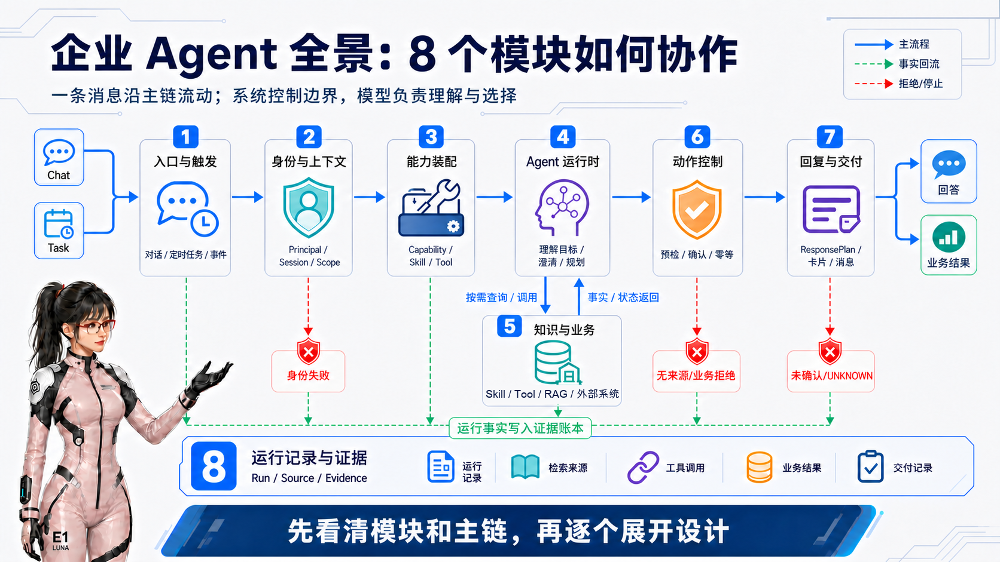

# 极速狂飙：5天开发一个企业级 Agent（设计篇之一·一条主链与八个模块）

## 1. 企业级 Agent 如何工作：一条主链，八个模块

先不要急着记住图中的英文名词。我们用一个普通例子走完整条链路：

> 一名员工说：“我明天下午要去医院，帮我请半天假。”

对用户来说，这只是一句话；对企业 Agent 来说，它至少要回答八个问题：消息从哪里来？说话的人是谁？现在有哪些能力可用？还缺不缺信息？请假规则是什么？能不能真的提交？应该怎样把结果告诉用户？事后如何证明整件事做对了？图中的八个模块围绕一条主链协作，其中第五个模块不是固定经过一次的流水线节点，而是 Agent 依据 Skill 按需取得知识与业务事实的执行循环。

### 先分清 Agent 和企业应用代码

这里需要区分两个容易混在一起的角色：一边是使用大模型进行理解与判断的 **Agent**，另一边是企业自己编写和部署的**普通应用代码**。后者包括入口网关、身份与会话服务、能力装配与工具管理、知识检索、写操作控制、数据库，以及负责把结果转换成网页、API 或飞书消息的格式转换代码。

这套普通代码与 Agent 承担不同职责：

- **Agent** 负责处理自然语言和不确定问题：理解用户到底想做什么、判断还缺哪些信息、从可用能力中选择合适的业务方法和工具、根据返回事实调整路径，并把结论组织成人能理解的内容；
- **企业应用代码**负责处理可以确定判断、必须强制执行的问题：身份是谁、哪些能力可以出现、参数格式是否合法、数据能否访问、是否必须确认、是否重复提交、状态怎样流转、能否重试、最终如何落库和发送；
- **知识库和真实业务系统** 负责提供事实：制度原文、余额、排班、申请状态和最终业务结果都不能由 Agent 自己创造。

可以记住一个简单原则：**需要理解语义和临场组合的事情交给 Agent；能够明确校验、涉及安全与副作用的事情交给企业应用代码。** 很多步骤会采用“Agent 提议，代码校验”的方式合作，而不是只由其中一方决定。

### 这套设计不是把工作流换成聊天入口

传统工作流需要开发者预先画出路径：用户满足 A 条件就走 B，遇到 C 就进入 D；没有被设计出来的分支，系统通常就无法处理。它适合路径固定、规则清楚的流程，却很难覆盖信息顺序不断变化、现场条件临时改变、需要跨知识与多个业务系统组合判断的服务。

这套 Agent 设计采用另一种分工：**企业应用预先固定可用能力、安全边界和最终执行规则，但不穷举完成目标的每一条路径；Agent 再利用 Skill 提供的方法和 Tool 提供的能力，根据用户目标与实时事实自主组合路径。** 信息不足时可以补问，条件变化时可以改路，发现冲突时可以解释或停止，多个能力也可以为同一个目标协作。

因此，Agent 的自主性不是“想做什么就做什么”。它不能发明权限、伪造事实或绕过确认；它自主的是在授权范围内怎样完成目标。这正是企业 Agent 相对传统系统和固定工作流最重要的增量价值，后续设计篇会专门展开这一设计理念。

### 从一句话到一个结果，企业 Agent 的完整链路

**第一步，入口与触发接住请求。** 请求可能来自网页聊天、API、企业 IM，也可能不是人发来的，而是一个定时任务或业务事件。入口网关代码先识别消息类型、做基本校验和去重，再把它交给统一的 Agent 主链。这样，同一条企业 IM 事件被平台重复推送时，不会生成两次请假申请。

**第二步，身份与上下文确认“这次是谁在办什么”。** 身份与会话服务从可信渠道得到员工身份、当前会话、运行环境和允许操作的数据范围，而不是相信用户在聊天里自行声明“我是管理员”。它还要区分这是一次新聊天，还是原会话中的继续追问。这一步完全由服务端代码完成，不交给 Agent 猜测。

**第三步，能力装配准备当前用户可用的能力包。** 企业应用代码根据可信账号、角色、数据范围、租户配置、运行环境和功能开放状态，取得这名用户当前**有资格使用的能力集合**。例如，这名员工可能被允许查询本人排班、办理本人请假和检索制度，但不能查询他人信息或使用尚未开放的管理能力。这个允许集合后文会称为 Capability。它不根据用户这次问了什么而改变。随后 Agent 看到用户内容，再从这个集合中判断和选择与当前目标有关的业务方法与工具。代码负责决定“这个用户最多允许使用什么”，Agent 负责决定“这次实际需要使用什么”。

在具体运行时，Chat、Task 或某个渠道可以为了最小暴露原则，只把允许集合中的一部分交给 Agent；服务端任务也可以声明自己需要哪些能力。但这些条件都只能做筛选，不能改变账号原本是否有资格使用某项能力。用户内容同样只用于帮助 Agent 选择，不参与能力授权。

**第四步，Agent 运行时理解目标并决定下一步。** Agent 发现用户已经提供了日期和时长，但还没有说具体原因，于是先追问，而不是立即调用提交接口。收到补充信息后，它根据已经提供的业务方法判断信息是否齐全，再选择合适的工具。这里体现的是 Agent 的价值：它不是照着一条固定流程机械前进，而是根据当前信息选择、组合、补问和修正。后文会把这些业务方法和可调用工具分别称为 Skill 与 Tool。

**第五步，Agent 依据 Skill 按需取得知识和业务事实。** Skill 提供处理这类目标的方法；Agent 通过 Tool 调用 RAG 检索制度知识，或访问外部业务系统取得实时状态。事实返回后，Agent 可以继续判断、追问或调用下一项能力，因此这里是执行循环中的双向交互，而不是只能经过一次的固定步骤。模型不能凭自己的训练记忆猜测企业制度，也不能把“接口请求成功”误当成“业务已经批准”。MCP 等具体接入方式留到后面的模块设计中再展开。

**第六步，动作控制保护真实写操作。** 查询可以直接返回，但提交请假会改变真实业务数据。Agent 可以提出“信息已经齐全，可以申请提交”，真正的冻结参数、生成确认记录、等待确认、幂等认领和调用写接口则由动作控制代码完成。重复点击必须只产生一次效果；如果外部系统可能已经写入、却没有返回确定结果，状态应由代码记为 UNKNOWN，后续只开放状态查询，不能让 Agent 自动再提交一次。

**第七步，回复与交付把同一个结果送到不同渠道。** Agent 完成本轮判断后，企业应用把正文、可信事实、来源和允许的操作组织成一份渠道无关的结构化结果，再由普通代码转换成 H5、API、飞书文字或交互卡片。Agent 不直接生成可信按钮令牌，也不决定消息应该发送给哪个真实账号。后续设计篇会详细说明这类结构化交付结果；本文将其简称为 ResponsePlan。

**第八步，运行记录与证据把整件事串成可回查的事实链。** 企业应用记录这次运行是谁发起的、用了哪些能力、调用了哪些工具、读取了哪些信息来源、有没有执行写操作、业务系统返回了什么、最终发送了哪条消息。它不是为了“多记日志”，而是为了在重试、投诉、安全审计、故障恢复和自动化评测时，能够回答：这次到底做过什么？为什么得到这个结果？有没有重复执行？

### 八个模块各自防住什么问题

| 模块 | 通俗理解 | 它主要防止的问题 |
|---|---|---|
| 1. 入口与触发 | 统一接住聊天、任务和事件 | 假请求进入系统；同一事件被处理多次 |
| 2. 身份与上下文 | 弄清楚“谁、在哪个会话、以什么身份办事” | 模型或用户自行伪造身份、环境和操作对象 |
| 3. 能力装配 | 给本次 Agent 准备允许使用的业务方法和工具 | 把所有工具都暴露给模型；无关或关闭的能力被误用 |
| 4. Agent 运行时 | 理解目标、补齐信息、选择并组合能力 | Agent 只能回答固定问题，遇到变化就无法继续 |
| 5. 知识与业务 | Agent 依据 Skill 处理目标，通过 Tool 调用 RAG 或外部系统取得事实 | 模型凭记忆编造制度或业务状态；一次性预加载过多无关数据 |
| 6. 动作控制 | 在真实写入前冻结参数、确认、去重并处理未知状态 | 参数被偷换、重复提交、把 UNKNOWN 误报成成功 |
| 7. 回复与交付 | 先形成统一结果，再渲染成文字、卡片或主动提醒 | 飞书、H5 等渠道代码侵入 Agent；发送失败时被迫重跑模型或业务动作 |
| 8. 运行记录与证据 | 保存一条可定位、可关联、可验证的执行凭证链 | 只能看到最终文案，却无法解释来源、执行过程和真实副作用 |

### 哪些由代码决定，哪些由 Agent 判断

下面这张表可以作为整个设计的责任边界。这里的“代码”就是普通的企业应用代码，不包含模型判断。

| 问题 | Agent 的职责 | 企业应用代码的职责 |
|---|---|---|
| 用户想做什么 | 理解意图、识别话题变化和隐含目标 | 限制入口场景、轮次、时间和资源预算 |
| 还缺什么信息 | 根据语义和已提供的业务方法判断需要追问什么 | 对最终参数执行必填、类型、范围和业务约束校验 |
| 本次有哪些能力 | 看到用户目标后，从允许集合中选择实际需要的业务方法和工具 | 按账号、角色、数据范围、租户配置、环境和功能开放状态生成允许集合；运行模式只能缩小集合，不能授予新能力 |
| 工具怎样调用 | 生成或补全业务参数，决定调用顺序 | 注入身份、环境和数据范围；校验参数；拒绝模型伪造可信字段 |
| 应该使用哪些知识 | 生成查询、比较候选内容、选择有帮助的片段 | 先按访问权限、版本、状态和有效期过滤，并验证最终引用属于候选集合 |
| 是否可以执行写操作 | 判断信息是否齐全，向用户解释并提出动作意图 | 冻结参数、重新预检、生成确认、幂等认领并真正调用写接口 |
| 怎样表达结果 | 组织答案、解释事实、提出合理下一步 | 绑定真实来源和写操作记录，校验交付结果，脱敏并转换为渠道格式 |
| 失败后如何恢复 | 可以根据明确的工具失败结果改换允许的路径 | 根据持久化状态处理重试、租约、UNKNOWN、降级和终态围栏 |
| 最终业务结果是什么 | 解释业务系统返回的结果 | 以真实业务系统状态为准并持久化，禁止模型自行宣布成功 |

边界可以进一步概括成三类：

1. **纯 Agent 判断**：意图理解、自然语言追问、在允许集合内组合步骤、解释事实和组织表达；
2. **纯代码控制**：身份、能力装配、参数校验、数据权限、确认、幂等、状态机、超时、重试、交付和证据；
3. **Agent 提议、代码校验**：工具参数、知识引用、建议动作和 ResponsePlan 内容。

凡是涉及身份、权限、真实数据写入、重复执行、状态恢复和敏感信息的判断，都不能只依赖 Prompt 或模型自觉；凡是需要理解用户语言、适应信息顺序和现场组合的部分，也不应该被硬编码成无数固定分支。

### 运行记录与证据到底有什么用

普通应用日志往往只有一串文本：“调用成功”“发送完成”。它适合开发者排错，却很难证明某个用户请求与某次业务写入之间的关系。企业 Agent 需要保存结构化、彼此关联的记录：

- **Run**：这一次 Agent 执行从何时开始、何时结束、使用了哪个模型和能力快照；
- **Tool**：实际调用了哪个工具，输入输出属于哪一次 Run，结果是成功、失败还是未知；
- **Source**：回答中的事实来自哪篇文档或哪个业务系统，当时的版本和状态是什么；
- **Action**：是否发生真实写操作，确认记录、幂等键和最终业务状态是什么；
- **Delivery**：结果通过哪个渠道、以文字还是卡片发送，是否降级、重试或最终送达。

这些记录通过 ID 相互关联后，会形成一条类似快递物流的轨迹。它至少支持六类实际用途：

1. 用户问“为什么这样回答”时，可以找到当时真正使用的 Source；
2. 用户说“我只点了一次，为什么提交了两次”时，可以核对 Confirmation、Action 和幂等记录；
3. 服务崩溃重启后，可以从已保存的状态继续发送，而不是重新运行全部步骤；
4. 出现越权或数据泄露疑问时，可以审计这次运行使用了什么身份和能力范围；
5. 自动化评测可以检查 Tool、Source、Action 和 Delivery 是否真的存在，而不是只给最终文案打分；
6. 发布新版本后，可以比较错误率、UNKNOWN、重试和降级是否增加。

所以，第八个模块不是一个附属的“日志模块”，而是 Agent 的事实账本。没有它，系统只能展示一个看起来合理的答案；有了它，系统才能证明答案从哪里来、动作是否真的执行、失败后恢复到了哪一步。

### 再回到图中的三种线

现在再看图会更容易：蓝色实线是用户请求从入口走向结果的主链；绿色虚线表示每一步都把事实写入证据账本；红色分支表示某些条件不成立时必须停止，而不是硬生成一个答案。

整条主链最终遵守三个分工：**模型负责理解、规划、选择和表达；系统负责身份、边界、状态、副作用和证据；知识库与真实业务系统负责提供最终事实。**

### 本篇结论

企业级 Agent 不是一个直接连上模型的聊天框，而是一条由八个模块共同完成的受控主链。Agent 的智能集中在理解目标、补齐信息、选择能力、根据事实改路和组织表达；身份、授权、参数校验、真实写入、恢复与证据则由企业应用代码强制控制。

理解这条主链之后，后续所有设计问题都有了位置：Skill 和 Tool 为什么需要自主组合，Session 与 Run 为什么必须分开，RAG 和业务系统怎样提供事实，写操作为什么要确认和幂等，渠道发送失败又为什么不能重跑 Agent。

---

**设计篇导航：** 当前为第 1 篇「一条主链，八个模块」｜下一篇：「Agent 为什么不应该只是工作流机器」
