# 5天开发企业级 Agent（设计篇 02）｜不只是工作流

[上一篇](./01-agent-overview.md) 画出了企业 Agent 从入口到可信结果的完整主链。这一篇沿着其中最关键的一段继续向下拆：企业应用怎样先划定能力边界，再让 Agent 根据目标和事实自主组合 Skill 与 Tool；这套自主能力又怎样通过 Tool、MCP、Business Action 和证据链被约束住。

全文只有一条主线：

> 可信身份与规则 → Capability → Agent + Skill → Tool → Source → 重新判断 → Business Action → Evidence

这条链同时回答两个问题：**为什么企业 Agent 不该只是换了聊天入口的工作流机器，以及为什么它拥有自主性以后仍然可以被控制、验证和审计。**

## 1. 为什么固定工作流不够

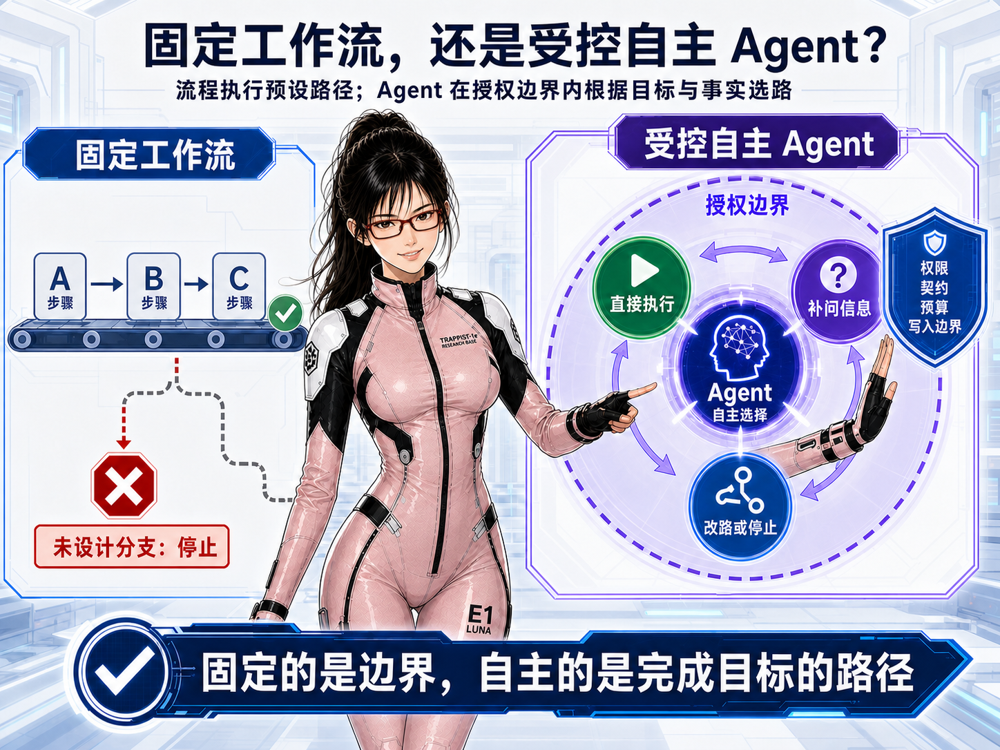

固定工作流擅长处理路径已经明确的事情：A 完成后执行 B，B 通过后进入 C。它稳定、透明、容易测试，但设计中不存在的分支通常也无法执行。

企业服务面对的情况往往没有这么整齐。用户可能先说目标，后补条件；也可能中途改口。查询结果可能只有一个候选，也可能出现冲突；外部系统还可能拒绝、超时，或者暂时无法确认结果。如果为每一种信息顺序、结果组合和异常状态都预先画流程，系统很快会变成庞大的分支树。

Agent 的价值不是把这棵分支树换成自然语言入口，而是：**在企业应用给定的能力和安全边界内，理解当前目标，选择合适的方法与工具，观察结果，再决定继续、补问、改路还是停止。**

因此，一次企业 Agent 运行通常同时存在两种控制流：

| 控制流 | 解决什么问题 | 典型内容 | 责任主体 |
|---|---|---|---|
| 确定性控制流 | 必须每次得到一致结果、能够审计和证明的问题 | 身份解析、权限过滤、Schema 校验、确认、幂等、状态机、超时和记录 | 企业应用代码 |
| Agent 决策流 | 无法预先穷举、必须结合语义和现场事实的问题 | 理解目标、发现信息缺口、选择 Skill、组合 Tool、解释结果和调整路径 | Agent |

这不是在“工作流”和“Agent”之间二选一。合理的设计是：**固定权限、契约、预算和写入边界，让 Agent 自主决定完成目标的实际路径。**

### 同一个目标，为什么会出现不同路径

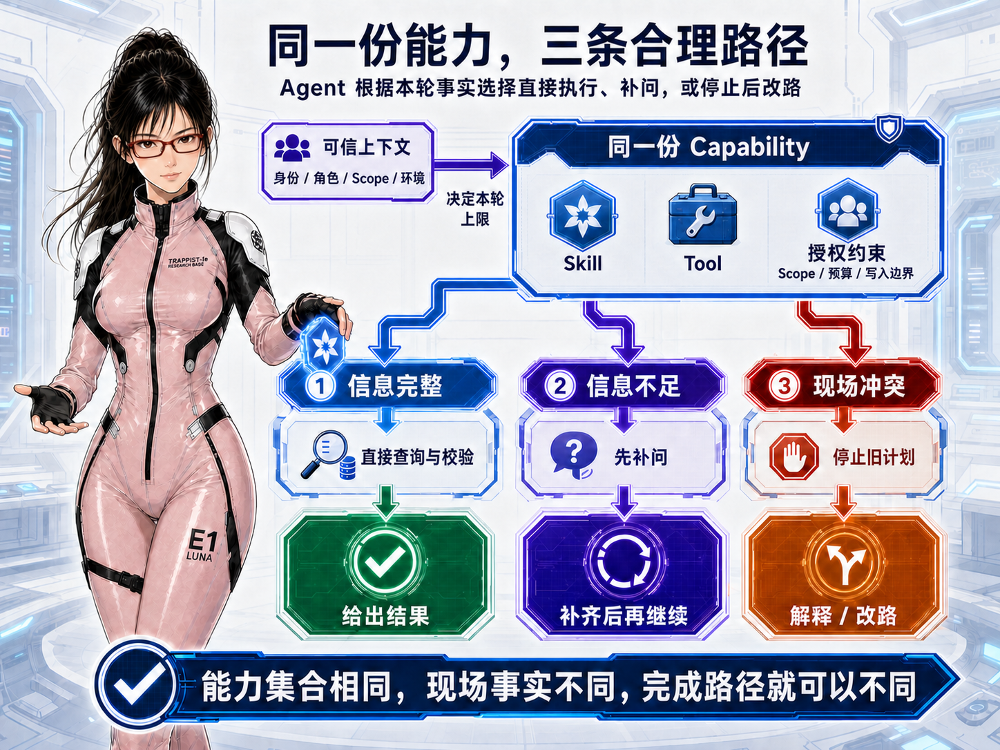

例如，用户希望得到一份“不与已有安排冲突、符合规则、确认后才提交”的结果。

- 信息完整、查询无冲突时，Agent 可以直接校验并展示待确认内容；
- 缺少关键条件时，Agent 应先补问，而不是猜一个值继续执行；
- 查询到多个候选时，Agent 可以解释差异并请用户选择；
- 预校验失败时，Agent 应停下来说明原因，而不是机械进入提交；
- 外部系统返回未知状态时，Agent 不应宣称成功，而应查询终态或明确告诉用户尚未确认。

这些路径使用的是同一组授权能力，只是因为本轮事实不同而得到不同结果。开发者不必穷举所有对话顺序，Agent 可以在边界内动态选路。

它的运行过程可以概括为一个有界循环：

1. 理解用户最终想得到什么；
2. 根据 Skill 检查已知条件、缺失信息和必须核实的事实；
3. 只从本轮 Capability 中选择 Skill 或 Tool；
4. 观察 Tool 返回的新事实、业务拒绝和错误状态；
5. 重新决定继续、补问、改路、等待确认还是停止；
6. 在回合数、Tool 次数和 deadline 内形成结果，并保存证据。

关键不在于模型是否一次规划出“完美六步”，而在于：**每当新事实出现，它都能重新判断；无论怎样改路，又都不能越过代码控制的身份、授权和副作用边界。**

## 2. 一次完整运行中，各层怎样协作

上面的循环仍然比较抽象。沿着一次真实 Run 往下看，各层的关系会清楚很多：企业应用先生成 Capability；Agent 参考 Skill 选择 Tool；Tool 带回事实与 Source；Agent 再根据事实调整路径；涉及写入时进入 Business Action；最后所有过程形成 Evidence。

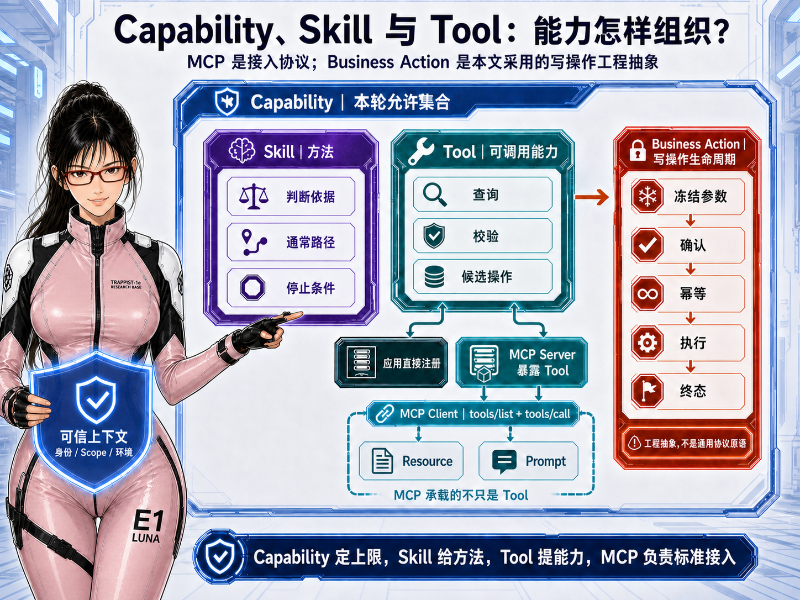

### 第一步：Capability 先确定本轮最多允许什么

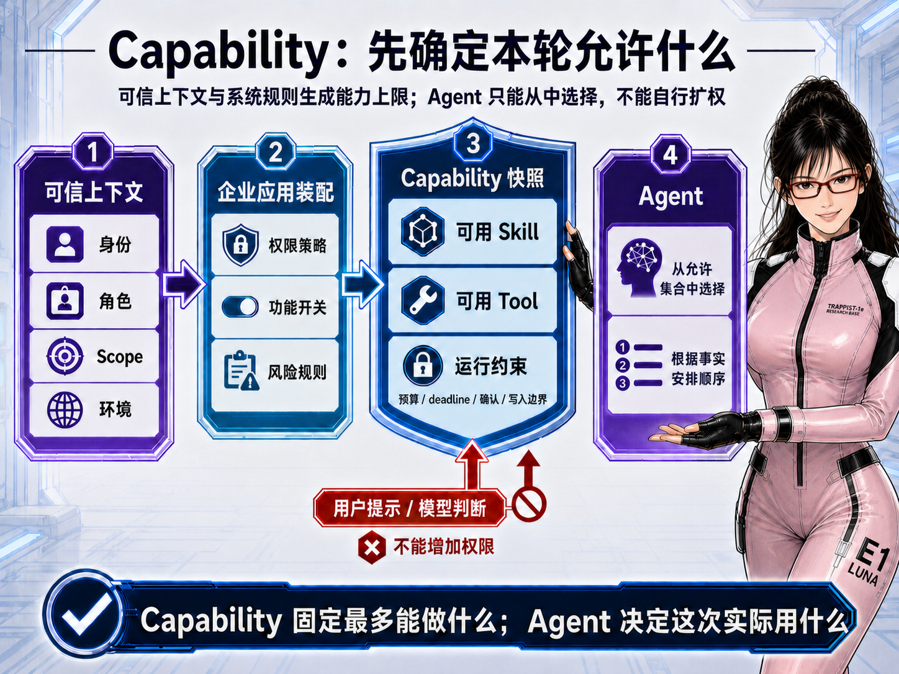

Agent 开始思考之前，企业应用必须先回答：**当前这个人，在当前环境和数据范围内，最多允许这个 Agent 做什么？** 本文把这份答案称为 Capability。

Capability 可以理解为由企业应用生成的“本轮授权能力包”。它不是某个 Tool，也不是根据用户话语猜出来的业务场景。它把身份、角色、数据 Scope、运行环境、功能开关、风险规则和依赖状态计算为本轮真正可见的 Skill、Tool 与运行约束。

工程上可以区分两个层次：

- **Capability Contract** 是长期定义：某项能力适用于谁，依赖哪些 Skill 与 Tool，风险等级、确认要求、预算和成功条件是什么；
- **Capability Snapshot** 是某次 Run 的不可变快照：当前身份和策略计算后，本轮实际获得了哪些 Skill、Tool 与约束。

Contract 可以随着产品设计迭代；Snapshot 一旦绑定到 Run 就不应被覆盖。否则事后无法解释：为什么这个 Agent 当时看到了某个 Tool，又为什么有权调用它。

用户的自然语言目标会影响 Agent 在能力包中选择什么，却不能扩大能力包。关闭一项能力也不能只在 Prompt 里提醒“不要使用”，而应让它根本不进入模型可见列表和服务端 Tool 注册表。

所以两句话就能区分边界：

> Capability 固定“本轮最多能做什么”。 
> Agent 决定“这次实际使用什么、按照什么顺序使用”。

### 第二步：Skill 给方法，Agent 根据现场事实选路

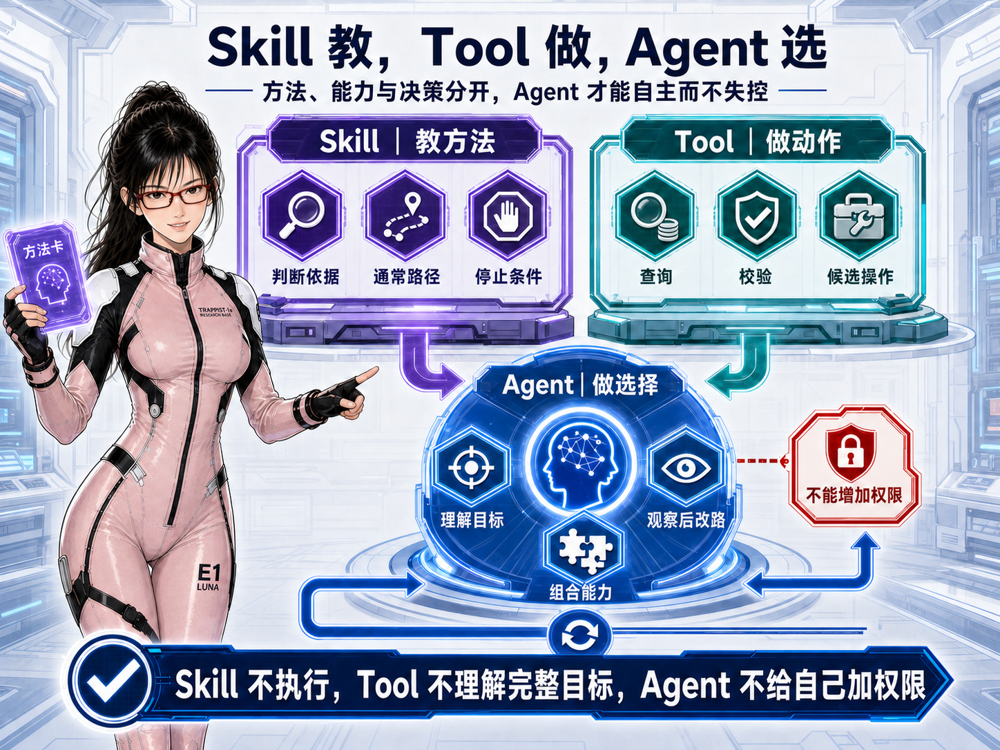

Skill、Tool 与 Agent 可以先记成三个动词：**Skill 教，Tool 做，Agent 选。**

| 组成 | 正式责任 | 应包含什么 | 不应承担什么 |
|---|---|---|---|
| Skill | 为一类目标提供可复用的方法和判断依据 | 适用条件、必要信息、通常路径、跳过条件、冲突处理、停止点和表达建议 | 真实身份、生产密钥、最终授权和业务成功状态 |
| Tool | 暴露一次窄而明确、可以独立观察的查询或操作能力 | 名称、用途、请求 Schema、结果 Envelope、稳定错误类别和 Source | 理解完整目标、组织整条流程或自行扩大数据范围 |
| Agent | 在本轮能力范围内理解目标并动态组合能力 | 识别缺口、选择 Skill、请求 Tool、比较结果、补问、改路和解释 | 给自己授权、伪造事实、绕过确认或宣布写操作成功 |

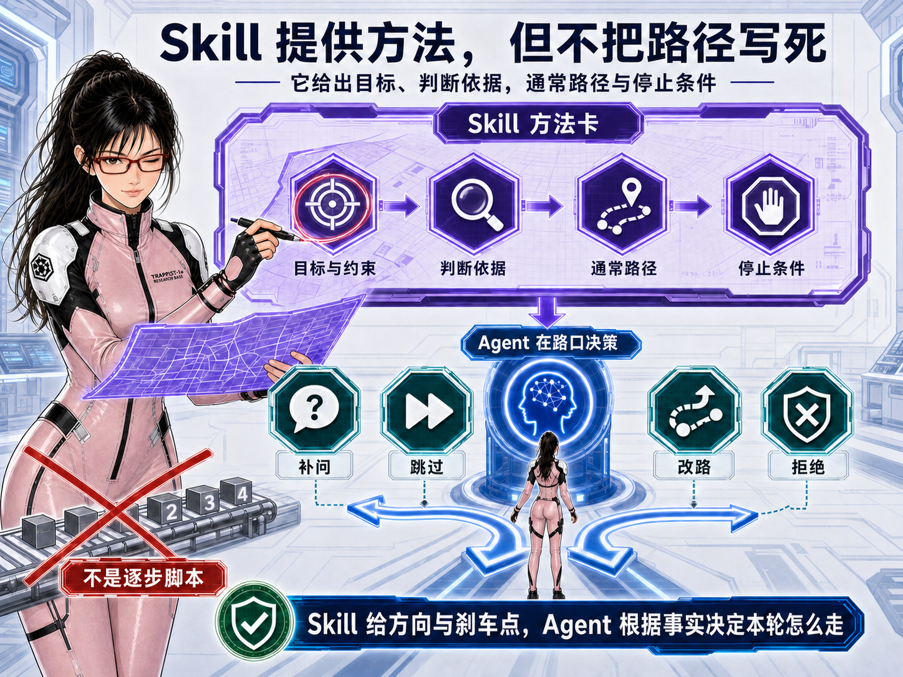

好的 Skill 不是另一种工作流脚本。它描述完成一类目标的方法：什么情况适用，需要哪些信息，通常怎样推进，哪些步骤可以跳过，什么时候必须停止，以及结果应如何解释。

例如，一份“安排服务”的 Skill 可以告诉 Agent：先确认目标与约束；信息不足时补问；出现多个候选时比较；规则冲突时停止并解释；真正写入前展示关键内容。它并不要求每次都机械执行同样的五步。信息完整时可以跳过补问，预校验失败时也不应继续提交。

Skill 因而给 Agent 方向、判断依据和刹车点，却不预先决定本轮唯一的完成路径。它可以包含辅助脚本或模板，但即使 Skill 建议“下一步提交”，真正能否提交、提交哪些冻结参数以及怎样确认，仍由 Capability、Tool 契约和写操作控制层决定。

那么，什么样的 Skill 才算合格？它至少应该把下面几件事讲清楚：

| Skill 契约 | 需要说明的内容 | 为什么需要 |
|---|---|---|
| 目标与适用范围 | 它帮助 Agent 完成什么目标；哪些请求适用，哪些明确不适用 | 避免仅凭名称或关键词误用 Skill |
| 成功标准 | 最终应得到回答、候选方案、待确认动作，还是已经核验的业务结果 | 让 Agent 知道什么时候可以结束，而不是无限继续调用 |
| 必要信息与来源 | 哪些信息必须向用户询问，哪些应通过 Tool、RAG 或真实系统取得 | 防止把模型猜测当作用户输入或业务事实 |
| 方法与判断依据 | 通常怎样推进，如何比较候选，哪些结果需要改路 | 给 Agent 决策方法，而不是写死唯一流程 |
| 跳过条件与停止点 | 哪些步骤可以省略；出现冲突、拒绝、无证据或 `UNKNOWN` 时怎样停止 | 防止为了走完整流程而强行继续 |
| 可用能力关系 | 可以配合哪些 Tool，各 Tool 的调用前提和结果语义是什么 | 让 Skill 与真实能力连接，而不是只提供抽象建议 |
| 写入与确认边界 | 哪些内容必须在写入前展示、冻结或取得用户确认 | 防止 Skill 的建议绕过企业应用的副作用控制 |
| 结果表达与证据 | 怎样向用户解释结果、风险和失败原因；需要展示哪些 Source | 让最终回答可理解、可追溯，而不是只有一句“处理完成” |

好的 Skill 还应同时满足三条质量要求：

1. **换一种表达仍然适用。** 它围绕用户目标和业务判断编写，而不是绑定某几个触发词；
2. **换一组事实可以改变路径。** 信息完整时能跳步，条件冲突时会改路或停止；
3. **离开越权能力也不会假装完成。** Tool 不可用、事实不足或写入未确认时，Skill 会指导 Agent 诚实收口，而不是用自然语言补造结果。

因此，判断 Skill 好不好，不是看它写了多少步骤，而是看它能否让 Agent 在多种真实情况中作出一致、合理且有边界的判断。**写得过细，它会退化成脆弱的工作流；写得过空，它又只是几句没有执行价值的提示词。**

> **扩展工具｜Code2Skill**
>
> Code2Skill 可以从已有前端、后端或全栈代码中提取业务能力，生成可审查的 Function、MCP Tool、Agent Skill 与离线测试，帮助已有系统更快接入 Agent。
>
> 介绍文章：**【文章链接】** ｜ GitHub：**【GitHub 链接】**

### 第三步：Tool 把真实能力和事实带进 Agent

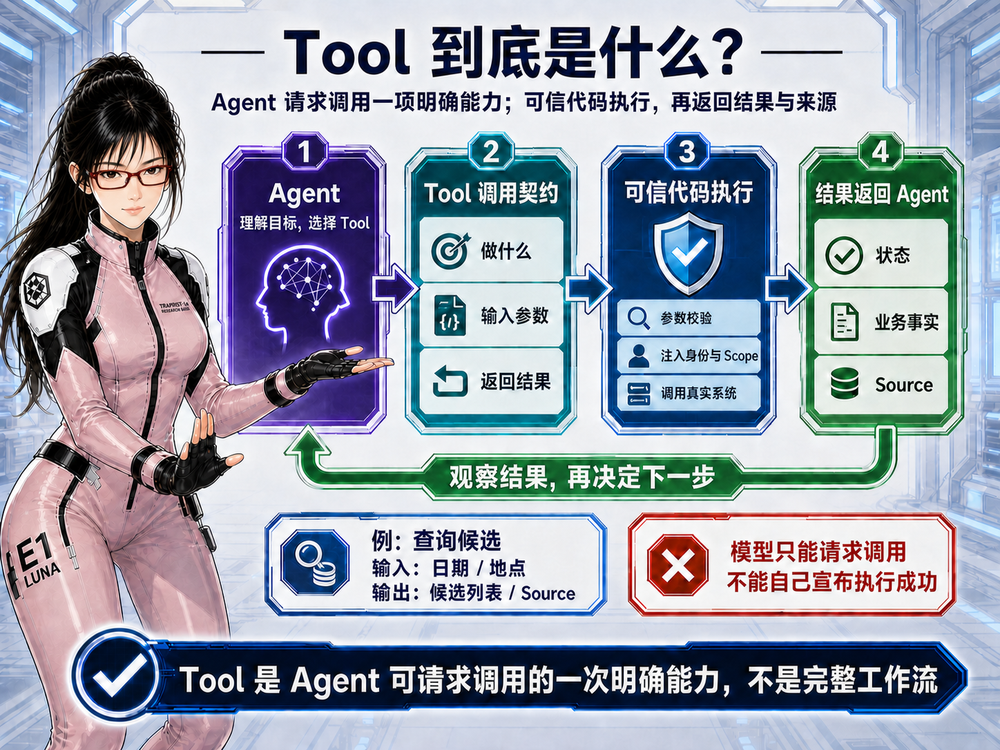

Tool 是 Agent 可以请求调用的一项结构化能力。它不是提示词，也不是完整工作流，而是一份明确契约：**这项能力做什么，需要哪些业务参数，会返回什么数据、状态与来源。**

例如，Agent 为用户寻找可选安排时，可以请求调用“查询候选” Tool，并提供日期、地点等业务参数。企业应用收到请求后，会校验参数，注入可信身份与 Scope，再调用数据库、检索服务或业务接口。Tool 返回候选、执行状态和 Source，Agent 观察这些新事实后，才决定回答、继续校验、补问还是停止。

这里最重要的边界是：**模型只能请求调用 Tool，真正执行 Tool 的是可信代码。** 身份、权限、环境、密钥和幂等信息不由模型自由填写；Tool 也不能因为模型声称“成功”，就跳过真实系统结果。

一个适合企业 Agent 的 Tool 至少需要四部分：

| Tool 契约 | 内容 | 为什么需要 |
|---|---|---|
| 能力说明 | 做什么、什么时候使用、明确不做什么 | 让 Agent 正确选择，而不是只靠名称猜用途 |
| 请求 Schema | 模型需要提供的业务字段、类型、枚举和必填项 | 拒绝多余字段，避免把身份和权限混入模型参数 |
| 执行边界 | 可信上下文注入、授权、依赖调用、timeout 与幂等 | 确保真正执行由代码控制 |
| 结果 Envelope | 协议状态、业务状态、尽可能完整的原始业务响应、规范化字段、错误类别、可重试性和 Source | 避免适配器过早丢失信息，让 Agent 能基于完整事实继续判断 |

HTTP 200、函数正常返回和业务成功不是一回事。外部接口可能正常响应，却明确拒绝业务；非 2xx 响应也可能在正文中带回准确的拒绝原因、当前状态和可选方案；写请求还可能超时而结果未知。

因此，Tool Adapter 不应该只看状态码，然后把真实响应压缩成一句 `success=false` 或通用错误文案。更稳妥的结果应同时保留两层信息：

- **原始业务响应：** 尽可能保留上游实际返回的状态、字段、错误正文和候选信息，让 Agent 看见完整事实；
- **规范化元数据：** 由可信代码补充协议状态、业务状态、稳定错误类别、是否可重试、是否可能已经产生副作用以及 Source 引用。

Agent 可以阅读原始业务响应，结合 Skill 和当前目标判断应该解释、补问、换路还是停止；企业应用代码则继续负责权限、Schema、重试和写入终态，不能把这些权威判断重新交给模型。

这里的“原始”也不等于不加控制地把所有字节塞进上下文。密钥、认证头和不应暴露的个人信息必须先移除；超大内容、文件和二进制数据应保存为受控 Source，再通过引用或截取后的相关片段提供给 Agent；外部响应中的文本只能作为不可信数据，不能被当成新的系统指令执行。

也就是说，正确方向不是“代码替模型过早总结”，也不是“把安全控制全部交给模型”，而是：**事实尽量完整地返回，权限和副作用仍由代码控制，业务路径由 Agent 根据完整事实判断。**

### 第四步：Tool 返回事实后，Agent 判断下一步，代码控制真正执行

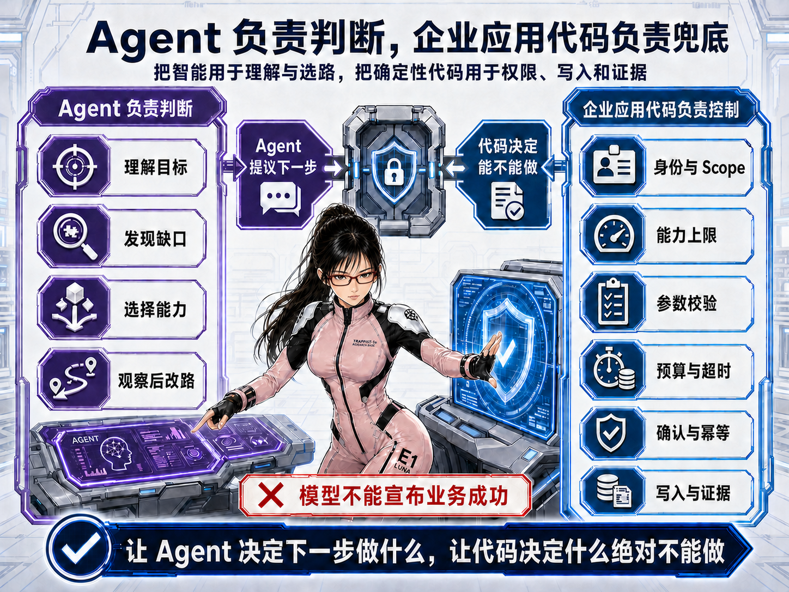

上一节讲的是 Tool 怎样把真实数据、业务状态和 Source 带回 Agent。但 Tool 返回结果并不等于任务已经结束：Agent 还需要理解这些新事实，判断应该直接回答、继续查询、向用户补问、换一条路径，还是停止执行。

这正是 Agent 自主性的落点。**Agent 根据 Tool 返回的事实决定“下一步想做什么”；企业应用代码则判断“这一步是否允许，以及应该怎样被安全执行”。** 两者共同组成一次完整循环：

> Agent 选择 Tool → 可信代码执行 Tool → Tool 返回事实与状态 → Agent 重新判断 → 可信代码再次校验和执行

如果只有前半段，系统仍然只是固定的接口编排；如果没有代码控制的后半段，模型的一次错误判断就可能直接变成越权访问或真实业务副作用。因此，这一节不是突然插入一组安全规则，而是在说明：**前面讲的自主组合能力，怎样在每一次实际调用中被约束住。**

自主不等于把系统交给模型自由发挥。Agent 负责语义理解和路径选择，企业应用代码负责不可妥协的执行边界。

| 运行问题 | Agent 可以判断 | 企业应用代码必须控制 |
|---|---|---|
| 当前目标是什么 | 理解意图、隐含约束和信息缺口 | 固定运行模式、可信主体和数据 Scope |
| 下一步做什么 | 选择 Skill、补问或请求 Tool | 只暴露 Capability 允许的能力并强制预算 |
| Tool 参数怎样形成 | 提取本轮业务字段 | 注入身份、环境、密钥和幂等键，执行 Schema 与业务校验 |
| Tool 返回后怎样继续 | 比较事实、改路、解释或停止 | 保存 Tool、Source 和稳定终态，拒绝越权结果 |
| 是否产生真实写入 | 提出候选动作并解释影响 | 冻结参数、获得确认、幂等执行并核验最终状态 |

这里的“企业应用代码”具体包括身份与授权服务、Capability Resolver、Tool Adapter、Policy、Action Controller、状态机和 Records 等确定性组件。它们保证：即使模型判断错误，也只会得到一次被拒绝或安全失败的请求，而不会把错误直接变成业务副作用。

一句话概括：**Tool 为 Agent 带回事实，Agent 据此决定下一步想做什么，代码决定这一步能不能做、怎样安全地做。**

到这里，一次运行内部的责任链已经完整：Capability 限定能力范围，Skill 提供方法，Tool 取得事实，Agent 根据事实改路，企业应用代码守住执行边界。接下来只需要回答另一个问题：无论这次运行是由用户聊天发起，还是由定时任务和业务事件主动触发，这套责任链是否仍然保持一致。

### Chat 与 Task 只是入口不同，运行边界不能分叉

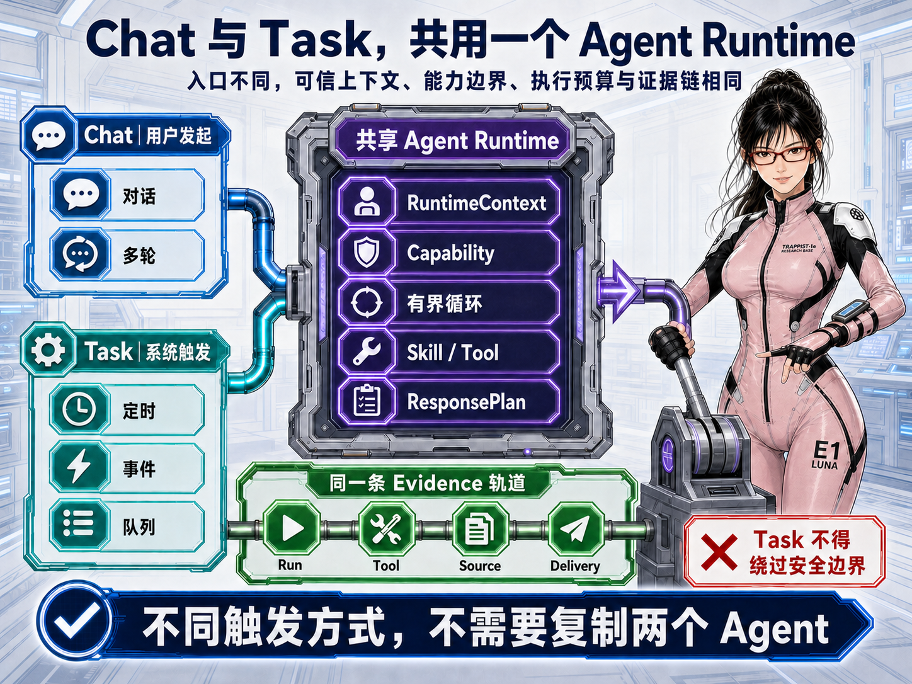

Agent 不一定由用户聊天触发。定时器、业务事件或任务队列也可以创建一次受控 Task，例如周期巡检、状态变化处理和主动提醒。

Chat 决定“用户何时发起”，Task 决定“系统何时开始”；进入运行时以后，两者都应使用同一套可信上下文、Capability、执行预算、Skill、Tool、Action 和 Evidence。

| 对比项 | Chat | Task |
|---|---|---|
| 发起方式 | 用户消息 | 定时器、业务事件或服务端任务 |
| 目标来源 | 从自然语言理解，可多轮澄清 | 服务端冻结目标、对象和 deadline |
| 等待方式 | 可以在 Session 中继续询问用户 | 通常不能无限等待，应按策略降级或停止 |
| 交付位置 | 当前会话 | Task 指定的可信接收人和渠道 |
| 恢复依据 | Session 与最新一轮 Run | 持久化 Task、lease、attempt 和 Run 状态 |

所谓共用 Runtime，不是让 Chat 与 Task 的交互完全相同，而是让身份、Capability、Tool、Action 和 Evidence 使用同一套权威实现，再由运行模式决定能否追问、如何确认以及怎样交付。Task 的接收人、目标对象和 deadline 必须来自服务端任务，不能被模型参数覆盖。

## 3. Capability、Skill、Tool、MCP 与 Action 到底是什么关系

把一次运行看完以后，再回头整理术语就不容易混淆了。它们并不是五种并列的“能力”。更准确的关系是：

> Capability 包含本轮允许使用的 Skill 与 Tool； 
> Tool 可以由当前应用直接提供，也可以由 MCP Server 暴露； 
> 会产生真实副作用的 Tool 调用，需要进入受保护的 Business Action 生命周期。

| 名词 | 本文中的定义 | 标准属性 | 它不是什么 |
|---|---|---|---|
| Capability | 企业应用根据可信上下文生成的本轮授权能力包，包含允许的 Skill、Tool 与运行约束 | 本文采用的企业工程抽象，不是 MCP 原语 | 不是意图分类，也不是一个可调用 Tool |
| Skill | 为一类目标提供方法、判断依据、通常路径和停止条件的可复用能力包 | Codex、Claude Code 等产品广泛采用，但目前没有统一的跨厂商协议格式 | 不是必须逐步照做的固定工作流 |
| Tool | 模型可以请求调用的一项结构化能力总称 | 多个 Agent/模型平台共有的上位概念，具体类型和 Schema 因平台而异 | 不是完整 Skill，也不是 MCP 的同义词 |
| MCP | 让 Client 与 Server 标准化发现和调用 Tool，并访问 Resource、Prompt 的开放协议 | 有正式协议规范 | 不是所有 Tool 必经的运行层，也不等于远程 HTTP |
| Business Action | 对真实业务副作用进行冻结、确认、幂等执行和终态追踪的持久化实体 | 本文采用的企业写操作抽象，不是跨厂商统一原语 | 不是普通查询 Tool，也不是模型的一句“执行成功” |

这张表刻意区分了三种东西：行业普遍使用的上位概念、正式协议，以及本文为了企业工程边界采用的架构抽象。Tool 是模型可调用能力的上位概念；MCP Server 暴露的 Tool 是 Tool 的一种标准化接入来源。Skill 已成为编码 Agent 中很常见的能力组织方式，但不像 MCP 那样拥有一套跨厂商共同遵守的协议。Capability 和 Business Action 则是为企业权限与副作用治理采用的工程抽象。

### Tool 应怎样拆：看决策边界，不看接口数量

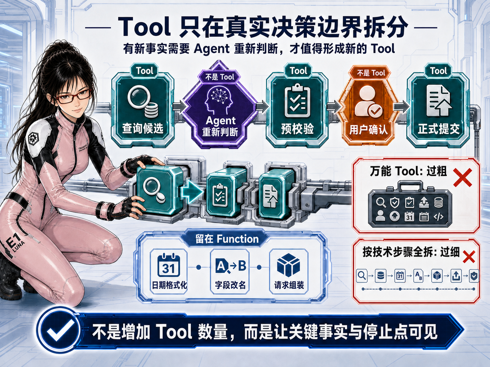

Tool 不是越大越好，也不是越多越好。把整条业务封装成一个“自动完成全部工作”的万能 Tool，会隐藏中间事实、失败状态和写入边界；按每个接口和技术步骤机械拆分，又会迫使 Agent 处理大量没有判断价值的细节。

判断是否需要拆成两个 Tool，可以问：**两步之间，Agent 是否得到新的业务事实，并需要据此重新决定下一步？**

例如“查询可选项 → 预校验 → 用户确认 → 正式提交”：

- 查询、预校验和正式提交之间会出现候选、规则冲突或副作用变化，适合形成边界明确的 Tool；
- Agent 向用户补问、用户点击确认，本身不是 Tool；
- 日期格式化、字段改名、签名和请求组装没有新的业务判断，应留在 Function 或 Adapter 内；
- 后端有三个接口，不代表 Agent 就必须看到三个 Tool；
- 一次简单只读查询能得到完整结果，也不应为了“看起来更 Agent”而制造多轮调用。

因此，Tool 的颗粒度不由函数、HTTP 接口或代码文件数量决定，而由 **Agent 什么时候真正需要看到新事实并重新判断** 决定。

### Function Tool 与 MCP Server Tool：同是 Tool，两种接入方式

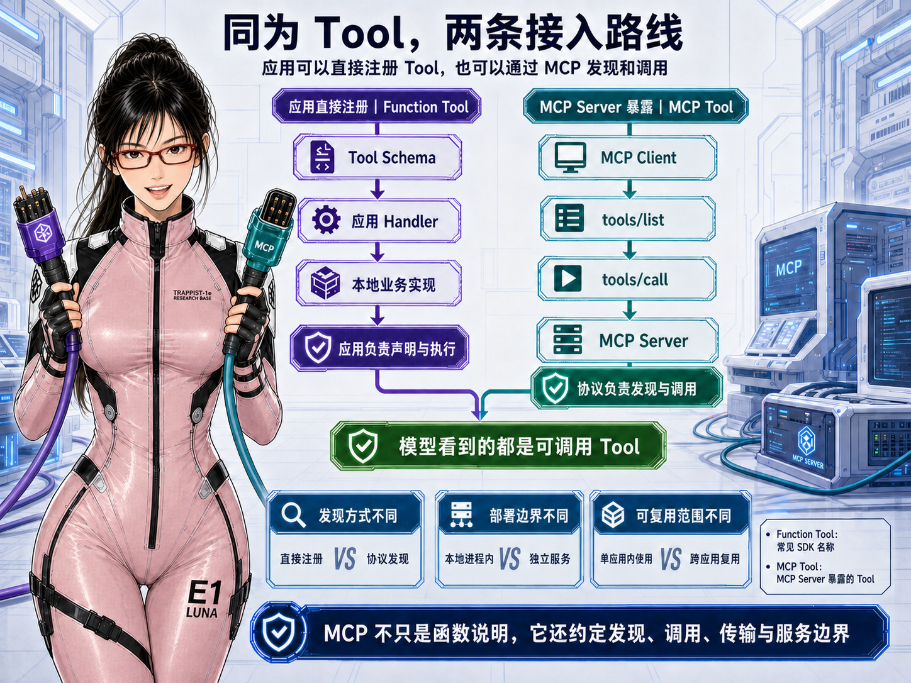

**Function Tool** 是 OpenAI Agents SDK 等体系使用的正式名称：当前 Agent 应用直接声明一个函数式 Tool，由应用内 Handler 执行。它是常见叫法，但并不意味着所有厂商都使用完全相同的类型名。

MCP 官方规范把 MCP Server 暴露的能力称为 **Tool**。工程实践里通常称为 **MCP Tool** 或 **MCP Server Tool**：MCP Client 通过 `tools/list` 发现，通过 `tools/call` 调用，真正实现位于 Server 一侧。

| 对比项 | Function Tool | MCP Server Tool |
|---|---|---|
| 谁声明 | 当前 Agent 应用直接注册 | MCP Server 通过协议暴露 |
| 如何发现 | 应用启动时加入模型 Tool 列表 | MCP Client 通过 `tools/list` 获取 |
| 如何调用 | 模型请求后由应用 Handler 执行 | MCP Client 通过 `tools/call` 调用 Server |
| 部署边界 | 通常与 Agent 应用同一代码和生命周期 | 可以独立进程、独立服务或跨语言部署 |
| 适合场景 | 应用内部轻量能力、与当前 Runtime 强绑定 | 多 Agent 复用、标准化接入、跨进程或跨语言 |

MCP 不只是“给 Function 增加说明”。它还定义能力发现、调用协议、传输、Server 边界和生命周期。但 MCP 也不会自动解决业务授权、可信参数、幂等、写操作确认和证据保存；这些仍由企业应用 Harness 与业务实现负责。

无论哪种接入方式，模型可见参数都只应包含本次操作所需的业务字段。身份、Scope、环境、密钥和幂等键由可信代码注入。

### Business Action：写操作为什么不能停留在一次 Tool 调用

查询 Tool 的结果通常可以直接返回 Agent；真正改变业务状态的操作则需要持续追踪。本文把这种受控写入称为 **Business Action**。它不是跨厂商统一标准，而是企业 Agent 中非常有用的工程抽象。

一次完整的 Business Action 通常包括：

1. Agent 或 Tool 根据已校验事实提出候选写操作；
2. 服务端冻结业务参数、契约版本、风险级别和展示摘要；
3. 用户确认的是这份被冻结的内容，而不是一段可以变化的模型文案；
4. Action Controller 重新核对身份、Capability、有效期和幂等键；
5. 可信执行器调用真实业务系统；
6. 系统核验终态并记录 `succeeded`、`failed` 或 `UNKNOWN`；
7. Tool、Source、确认事件和业务结果都关联回同一个 Action。

模型可以建议提交，也可以解释即将发生什么，但它不能决定确认绑定哪组参数，不能在超时后擅自重复提交，更不能根据自然语言响应自行宣布成功。**Tool 提供可请求的能力，Business Action 负责一次真实副作用从候选到终态的权威事实。**

相关标准可查阅 [MCP Tools 规范](https://modelcontextprotocol.io/specification/2025-06-18/server/tools)、[OpenAI Agents SDK Tools 文档](https://openai.github.io/openai-agents-python/tools/) 和 [OpenAI Agents SDK MCP 文档](https://openai.github.io/openai-agents-python/mcp/)。Capability 与 Business Action 是本文采用的企业工程抽象，不冒充跨厂商协议标准。

## 4. 为什么这套分层能保证工作质量

把上面的概念重新接回一条 Run，可以看到每一层都在处理一种不同的失败风险，而不是为了“架构完整”堆出更多名词。

| 要保证的质量 | 主要机制 | 它防止什么 |
|---|---|---|
| 目标理解正确 | Agent + Skill | 只匹配关键词、缺信息仍机械执行、固定流程无法改路 |
| 权限边界正确 | 可信上下文 + Capability Snapshot | Prompt 诱导扩权、未授权 Tool 暴露、跨身份或 Scope 调用 |
| 事实来源正确 | Tool Result + Source | 模型凭记忆编造业务状态、把模糊文案当机器事实 |
| 路径能够适应变化 | Agent 有界循环 | 新事实出现后仍执行旧计划、遇到冲突继续提交 |
| 副作用安全 | Business Action + 冻结参数 + 确认 + 幂等 + 终态 | 重复写入、确认内容漂移、超时后误报成功 |
| 运行能够收口 | 回合预算 + Tool 次数 + deadline + 状态机 | 无限循环、永久占用、旧执行体晚到写入 |
| 结果可以审计 | Run / Tool / Source / Action / Delivery Evidence | 系统“看起来成功”，却无法证明做过什么和为什么成功 |

这也是这套设计最重要的因果关系：

> Capability 让模型看不到不该用的能力； 
> Skill 让模型知道完成目标通常该关注什么； 
> Tool 把真实事实带回来； 
> Agent 根据事实重新选路； 
> Business Action 把写操作锁进确定性生命周期； 
> Evidence 证明每个结论和副作用从哪里来。

### 怎样证明 Agent 真的具有自主性

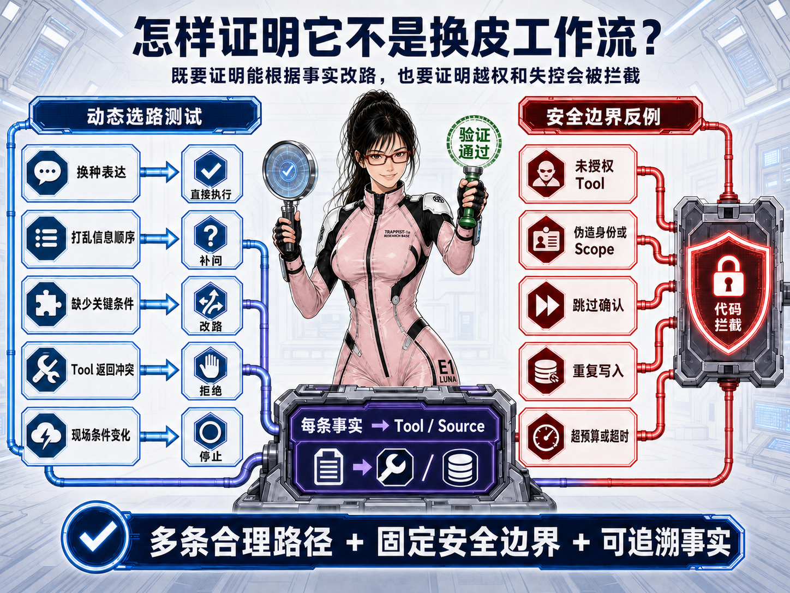

“不是换皮工作流”最需要证明的，首先是 **Agent 是否真的具有自主性**。这里的自主性不是输出文案更自由，也不是随机选择不同 Tool，而是：面对同一个目标，Agent 能否根据当前已有信息、Tool 返回的新事实和用户临时改变的条件，形成不同但合理的完成路径。

判断自主性是否真实存在，可以观察四件事：

1. 用户换一种表达或调整信息顺序，Agent 仍能理解同一个目标，而不是只识别固定话术；
2. 信息已经完整时，Agent 可以跳过不必要的补问；缺少关键信息时，又会主动停下来询问；
3. Tool 返回冲突、拒绝或新限制以后，Agent 会修改原计划，而不是继续执行预设下一步；
4. 目标无法安全完成时，Agent 能够解释原因并停止，而不是为了走完整条流程强行给出成功结果。

如果把用户意图一识别出来，后续步骤就已经全部固定，那么无论中间使用了多少次 LLM，它本质上仍然是一条由模型触发的工作流。只有 **路径会因为运行中的真实事实而变化**，Skill 和 Tool 才是在被 Agent 自主组合。

在证明自主性之后，还要再证明另一件事：这种自主性始终被确定性边界约束。前者证明 Agent 不是固定流程，后者证明它也不是不受控制的自由模型。两组验收不能互相替代。

| 证明对象 | 代表性用例 | 通过标准 |
|---|---|---|
| 自主理解 | 换表达、打乱信息顺序、临时修改条件 | Agent 围绕同一目标继续工作，不依赖唯一标准话术 |
| 自主选路 | 信息完整或缺失、Tool 返回新限制、中间候选发生变化 | Agent 能补问、跳步、重新组合 Tool、改路或停止 |
| 事实驱动 | 一个目标需要多个 Skill 或 Tool，中间结果会影响下一步 | 实际路径由本轮事实决定，而不是意图直接映射固定流程 |
| 权限边界 | 请求未授权 Tool、伪造身份或扩大 Scope | 在模型调用前或 Tool 执行前被确定性拒绝 |
| 副作用边界 | 跳过确认、重复点击、超时后重试 | 最多产生一次受控写入，结果不确定时不宣称成功 |
| 运行与证据边界 | 超出预算、晚到结果、无来源事实或 Source 不匹配 | Run 能收口，越界写入被阻止，每条可信事实可追溯 |

如果系统只能识别预设句子并走唯一分支，它仍然是脚本分派器；如果模型能够访问所有能力、直接决定写入，它又只是一个危险的自由模型。

企业 Agent 更合理的形态处在两者之间：**系统固定能力上限和安全底线，Agent 在其中自主理解目标、组合能力并依据事实调整路径。** 这不是牺牲智能换取控制，而是先让责任分层，Agent 才能在可证明的边界内真正发挥智能。

---

**设计篇导航：** [上一篇：一条主链与八个模块](./01-agent-overview.md)｜当前为第 2 篇「为什么它不该只是工作流」｜下一篇将讨论「通用 Harness 与业务能力如何解耦」
